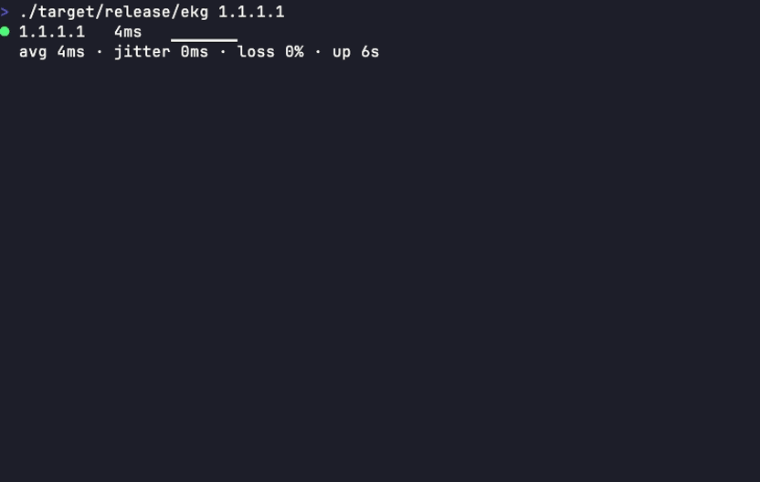

# ekg

A compact, in-place ping monitor. The machine that goes *ping* — without the wall of scrolling text.



```
● 1.1.1.1   12ms   ▁▂▂▃▂▁▂▂▃▂
  avg 14ms · jitter 2ms · loss 0% · up 2h14m
  last outage: 14:32 (36s)
```

ekg pings a host and renders a small status panel that updates **in place** — it never pushes your terminal down a line per ping. Leave it running in a corner pane all day; when your connection drops, it leaves exactly one permanent line per outage:

```
✗ outage 14:32:05 → 14:32:41 (36s)
```

## Features

- **In-place panel** — 2–3 lines, redrawn each tick; adapts to narrow panes (sparkline and stats shrink to fit)
- **Rolling stats** — average latency, jitter, packet loss % over a sliding window
- **Sparkline** — the last ~20 pings at a glance; timeouts show as red `×`
- **Quality color** — green / yellow / red by latency and loss
- **Outage log** — one permanent line per connection drop, with start time and duration; cap or disable with `-m`
- **Recorder** — `--log file.jsonl` appends every sample and outage event as JSON, for scripting or offline analysis
- **Outage hooks** — `--on-outage` / `--on-recovery` run a shell command when the connection drops/comes back, for push notifications or automations
- **Scripted runs** — `-c N` sends N pings and exits with a loss-based status code, no interactive session needed
- **No sudo** — uses unprivileged ICMP datagram sockets
- **Fast and tiny** — single static binary, six dependencies

## Usage

```bash
ekg                     # ping 1.1.1.1 every second
ekg 8.8.8.8             # another target
ekg my-router.local     # hostnames work
ekg -i 0.5 -w 120       # every 500ms, 120-sample window
ekg -m 5                # stop logging outage lines after 5 (0 = never log)
ekg --log ping.jsonl    # append each sample + outage event as JSONL
ekg -c 100              # send 100 pings, print summary, exit (0 = no loss)
ekg -c 100 --max-loss 5 # same, but allow up to 5% loss and still exit 0
ekg --on-outage 'ntfy publish home-net "down: $EKG_HOST"' \
    --on-recovery 'ntfy publish home-net "up: $EKG_HOST after ${EKG_OUTAGE_SECS}s"'
```

Ctrl-C prints a session summary: duration, sent/received, loss, min/avg/max, outage count. `-c`/`--count` prints
that same summary after N pings and exits — 0 if loss stayed within `--max-loss` (default: any loss fails), 1
otherwise — so it can drive shell scripts and cron/CI checks directly.

### `--log` JSONL schema

One JSON object per line, appended (not truncated) so an overnight run's data survives an interruption:

```jsonc
{"ts":1690300000123,"host":"1.1.1.1","rtt_ms":12.34}     // a reply
{"ts":1690300001123,"host":"1.1.1.1","rtt_ms":null}      // a timeout
{"ts":1690300003123,"host":"1.1.1.1","event":"outage_start"}
{"ts":1690300010123,"host":"1.1.1.1","event":"outage_end","duration_ms":7000}
```

`ts` is milliseconds since the Unix epoch. Sample lines have no `event` field; outage lines have no `rtt_ms`
field — check for the field's presence, not a fixed schema, when parsing.

### `--on-outage` / `--on-recovery` hooks

Run an arbitrary command when an outage is declared and when it recovers — for push notifications, external
logging, or automations (e.g. power-cycling a router):

```bash
ekg --on-outage 'ntfy publish home-net "ekg: $EKG_HOST is down"' \
    --on-recovery 'ntfy publish home-net "ekg: $EKG_HOST recovered after ${EKG_OUTAGE_SECS}s"'
```

Each command runs via `$SHELL -c` (falling back to `sh -c` if `$SHELL` is unset) — the same shell you'd get
in an interactive terminal, so pipes, quoting, and env var expansion all work as expected. It's spawned
**detached, in its own process group**: stdin/stdout/stderr are discarded, the ping loop never waits on it, and
it doesn't die alongside ekg on Ctrl-C or a terminal hangup — a slow or hung command (a flaky notification API,
a router that takes a while to reboot) can't stall monitoring or corrupt the panel, and a power-cycle command
gets to actually finish even if you Ctrl-C out of ekg right after triggering it.

Two safety bounds, so a flapping link can't pile up unbounded background work:

- **30s timeout, enforced on the whole process tree, independent of ekg** — the command isn't run directly;
  it's run inside a small watchdog wrapper that backgrounds it, waits, and — if 30 seconds pass first — sends
  `SIGKILL` to the entire process group. Because the wrapper, the command, and anything the command itself
  spawns (a pipeline, a child process) all share that one process group, the kill takes down the whole tree,
  not just the immediate process. And because the watchdog lives inside the hook's own process tree rather
  than as a task inside ekg, the timeout still fires even if ekg has already exited (Ctrl-C, or right after
  the last `--count` ping) — a hung hook can't outlive ekg and run forever.
- **Single-flight per target and per hook kind** — if the previous `--on-outage` for a given host is still
  running when that host's next outage is declared, the new invocation is skipped rather than stacked; a
  different host's `--on-outage` is entirely unaffected, since each target's single-flight state is separate.
  `--on-outage` and `--on-recovery` are likewise tracked independently, so one kind being in flight never
  blocks the other.

Cleanup isn't only a timeout thing: when the command finishes normally (before 30s), ekg still sweeps its
entire process group on the way out — so a command that backgrounds its own child and doesn't wait on it
(`sleep 60 &`) doesn't leave that child running past the hook's own completion. That sweep is two-stage: a
`SIGTERM` first (a straggler that traps it for its own cleanup gets a real chance to use it), then, after a
1-second grace period, an unconditional `SIGKILL` for anything still around — including a straggler that
ignores `SIGTERM` entirely. Either way, nothing from a completed hook outlives it by more than a second.

Env vars passed to the command:

| Var | When | Meaning |
| --- | --- | --- |
| `EKG_HOST` | both | the target host/IP that changed state |
| `EKG_OUTAGE_START` | both | outage start time, ms since the Unix epoch (same format as `--log`'s `ts`) |
| `EKG_OUTAGE_SECS` | recovery only | whole seconds the outage lasted |

Only these vars are ever set, and any of the same names already present in ekg's own environment are cleared
first — an `--on-outage` hook never sees a stale `EKG_OUTAGE_SECS` left over from somewhere else, for example.

## Install

```bash
brew install spaceshipmike/tap/ekg   # Homebrew (macOS or Linux)
cargo install ekg                    # crates.io
```

Once the first tagged release ships, `.github/workflows/release.yml` (generated by [cargo-dist](https://github.com/axodotdev/cargo-dist)) will publish prebuilt binaries and a curl installer to GitHub Releases for each pushed `vX.Y.Z` tag. The Homebrew tap is not part of that automated pipeline — `spaceshipmike/homebrew-tap` is maintained by hand and builds from source (the Homebrew route needs no Rust toolchain of your own; brew provides it at build time). Its formula picks up completions and the man page whenever it's next updated by hand, not automatically from a tag push.

### Completions & man page

`ekg` can generate its own shell completions and man page — there's nothing to download separately:

```bash
ekg --completions bash > /path/to/completions/ekg.bash
ekg --completions zsh  > /path/to/completions/_ekg
ekg --completions fish > /path/to/completions/ekg.fish
ekg --manpage           > /path/to/man/man1/ekg.1
```

These are packaging plumbing (`--help` doesn't list them). The Homebrew formula will generate and install both once it's hand-updated to do so; until then, generate them manually with the commands above.

### Linux note

Unprivileged ICMP requires the ping group range sysctl (most distros ship it enabled):

```bash
sudo sysctl -w net.ipv4.ping_group_range="0 2147483647"
```

## License

MIT OR Apache-2.0, at your option.
